**DOCUMENTATION OF DESIGN PROCESS FOR CODING 3 - WEB DESIGN STUDIO UNIT ASSESSMENT**

*Aim: design and develop a an accessible, cross-platform website that will include your creative portfolio*

Website requirements:
- include a short intro to you and your work
- include your weekly homework tasks along with documentation for each
- integrate at least 1 JavaScript library
- follow accessability guidelines: keyboard navigation, aria labels, alt text etc


- decided to plan website layout and design using Figma:

1st design:
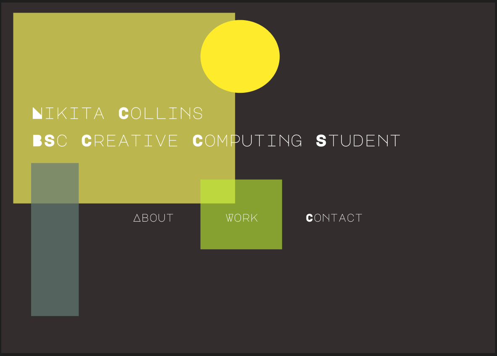

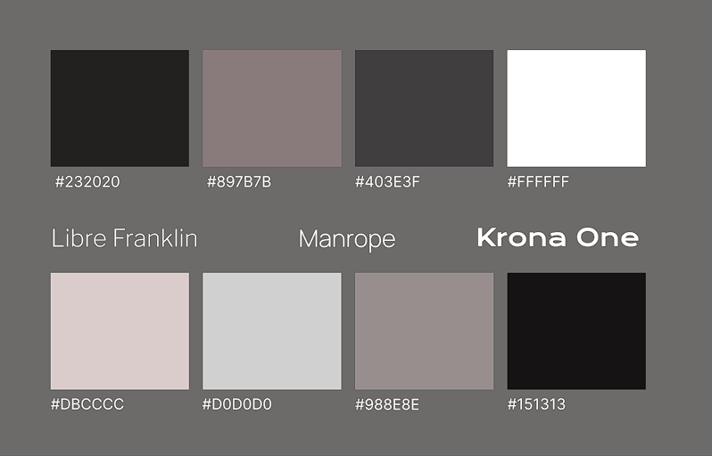

some colour swatches and font selections
thinking of adding a bright accent colour for contrast - bring attention to crucial areas of website, guide attention flow
- not too sure on Krona One font type yet

Focus on:
- clarity
- scannability
- motivation 
- fun! I want the visitor to enjoy exploring the website, communicates PERSONALITY

- wasn't too sure on initial wireframes so I made new ones:

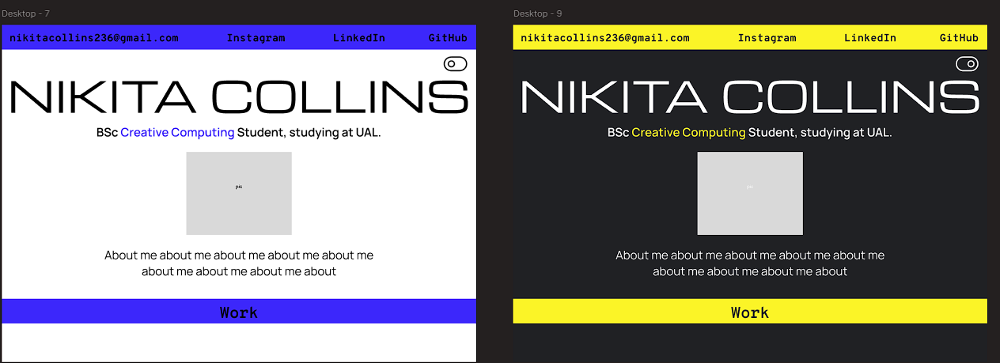


wanted to draw attention to my name, hence the large space it takes up
- i like this - more simple but communicates more effectively 
- slight retro style from font?
- thinking of having a horizontal scrolling of text inside the blue bar - like a scrolling text display
- two different contrast modes - light and dark (will affect rest of the website if toggled)
- clear layout - visitor is immediately met with past work and experience

made more wireframes for different templates (tablet and mobile phone)

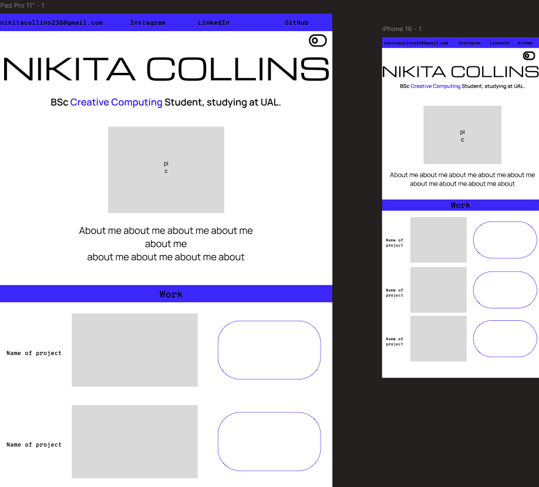

Happy with this wireframe - going to start coding now!
obviously will develop the style as I progress

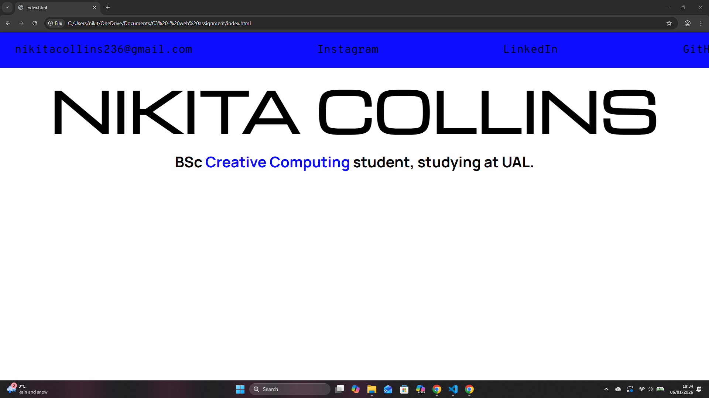

actually coding now!
Looking good and consistent with wireframe
Imported all fonts used in Figma using Google Fonts!
- also working with an index.html and external css stylesheet - try to keep code neat and can edit when needed

- created a nav bar for the blue bar at the top (".top_bar")
- however, 'GitHub' doesn't fit fully in the bar
- changed "justify-content = space-between" to use 'gap' of 300px


much better, spacing looks satisfying 
- also added links for each page so you can easily jump to find my other pages

- not too sure about main text (p1) font - something bigger, bolder

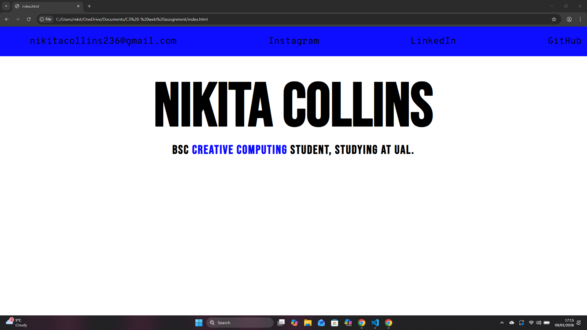

- changed font to Bebas Neue, both h1 and h2 - consistent title text 
- groups those two texts together into one block 
- more impactful on first visit

- added picture of me in center (me.jpg)
- made a circle class to make the image circular:

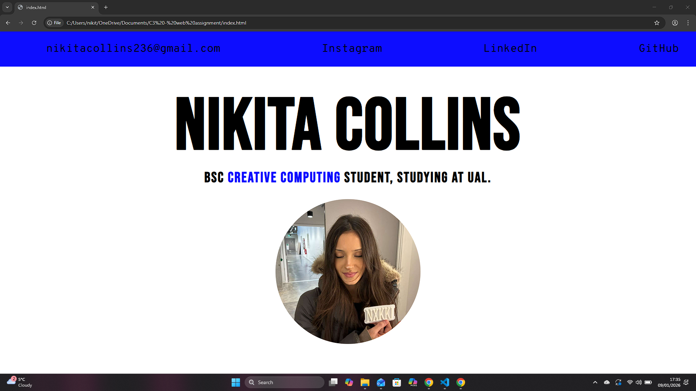

- thinking of changing wireframe
- more interesting way of accessing my work/project section
- want more animations 

- added little introduction but not happy about the font


honestly, feeling some creative block. can't really see this layout developing the way I'd like
- back to draw board..

- been researching other portfolio websites - gained inspo for new style
- more drawn to the stylised websites - less focus on big text and filling space
- first page should feel like a performance to draw users in 
- thinking of relating to my field: sleek, tech-inspired, digital feel, not bright and distracting, moody professional feel, still keep pop of colour 
- i know the first page has to be enticing - decided to use hyperlinks to different pages for my work and project section 
- want something geometric, techy feel, 'flowing lines', takes center position on page (text will surround)

- was really inspired by these 2 sites: 
https://portfolio-website-opal-phi-39.vercel.app/ 
https://michaelbardou.com/ 


# MUSIC VISUALISER DEVELOPMENT FOR WEBPAGE #

- created new sketch based on prior, changed composition of main page

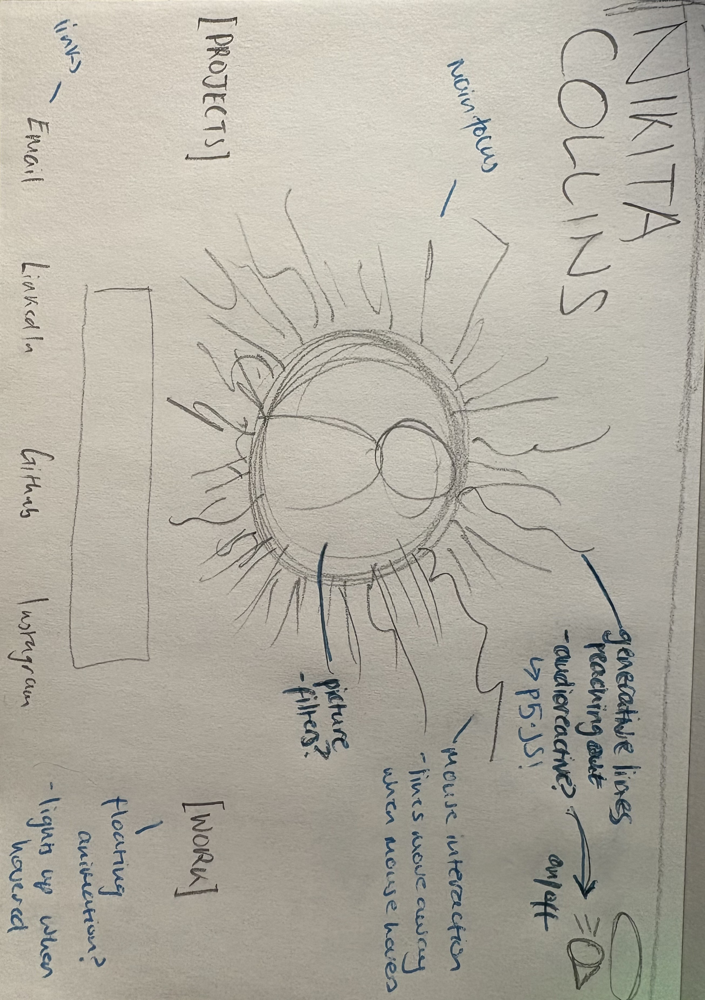

- will need to visit p5.js to code my generative lines - building upon music synthesizer I made previously.
- lines will branch out from behind my picture
- however, option to play music is up to the user (ux accessability)
- if music is not playing, lines just gently move 


- manipulated elements to make way for audio visualiser lines


from this old music visualiser code:
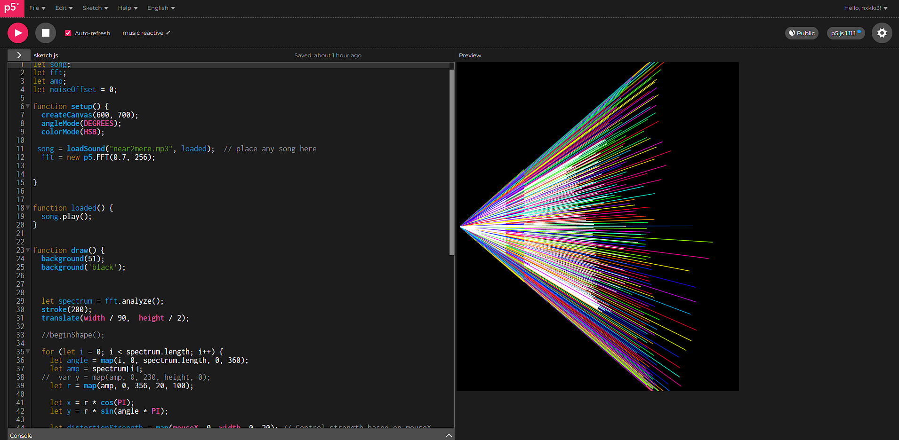

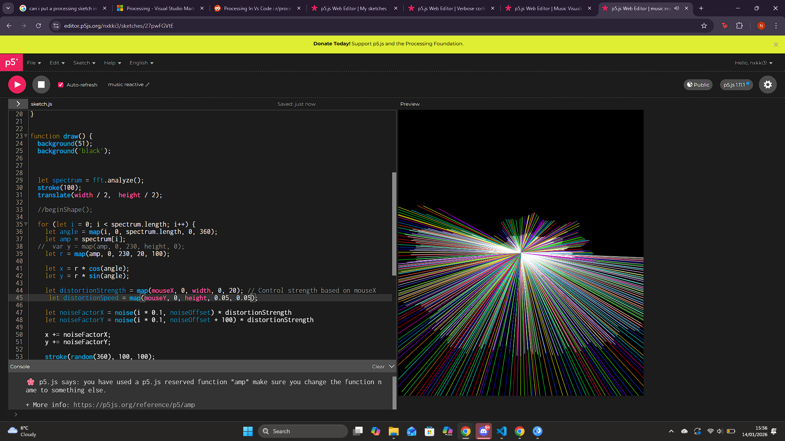

working on making the lines branch out from a center point, contained in a circle shape
need to work on distortion effects, want to contain it in a ring more
- distortions too chaotic right now, only branching out on the bottom part too
- reduced number of strokes for a cleaner look

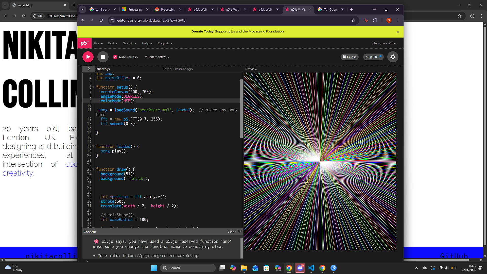

working correctly, just too large - need to shrink into contained circle 
- got it working, but want to edit the distortion for aesthetic purposes
- changed audioOffset from map() to pow() for more reactive movement
- all lines push out in a circle, looking good
- BUT when song kicks up, lines reach maxRadius so lines become indistinguishable
- changed ```r = constrain(r, 0, maxRadius);``` to  
```let r = baseRadius + audioOffset + globalPulse;
    let overflow = r - maxRadius;
    if (overflow > 0) {
      r = maxRadius + overflow * 0.25;
    }
```

- much better, lines can flow freely
- also reduced number of lines by adding ```step = 2;```
- few value changes to distortionStrength, noiseOffset and noiseFactorX + Y

- right now, the sketch is running with a 'near2me.mp3' file (Song i like)
- going to change this to see how it reacts with ambient noise (for playing on the website) 

found a nice free ambient noise mp3 file online: https://pixabay.com/sound-effects/musical-ethereal-ambient-music-55115/
- changed the sound file and now only part of the circle's lines move outwards again! argh...
- figured it out: only mirroring half the spectrum length
```let index = i > spectrum.length / 2 ? spectrum.length     - i: i;
    
    let ampVal = spectrum[index];
```

- changed to: 
```let ampVal = spectrum[i];
```

- also boosted sensitivity because ambient tracks have small fft bins:
```let audioOffset = pow(ampVal / 255, 1.5) * 120;
```

- working, but because its an ambient track the movement seems minimal 
- want it to be less of a heartbeat motion, but rather like a 'flowing energy feel' - no uniform movement
- removed overflow and globalPulse

- okay went through lots of tweaks, too time consuming to document every single one
main changes:
- adjusted sensitivity, max distortion, frequency scaling + few other values
- changed colour of lines from random to depend on amplitude (blue = low ampltide, red = high amplitude) - gives nice dynamic feel
- added freqBias for smoother audio offset scaling across the spectrum
- still having the issue where only a few lines are affected, but with ambient soundtracks the fft bins are small
- might change hue mapping to go around the whole circle:

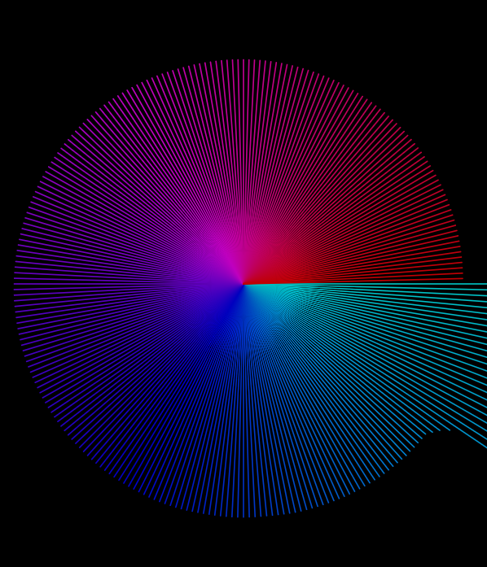
- liked the other version better + will suit my website more (blue theme)

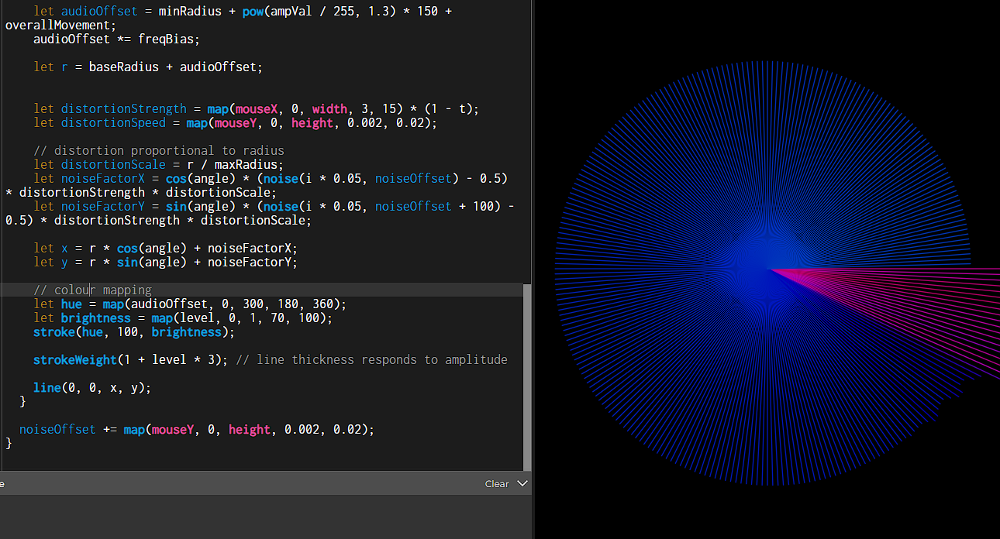
- final colour mapping + visualiser

- a bit different to my original idea, but i like the blue because it suits the colour theme
- seems to 'breathe' with the ambient noise
- hue mapping excenuates the higher notes, reactive colour changes looks good
- also removed the black background so when imported, there won't be a background for the sketch
- the best i could get with an ambient track!

now, going to attempt to import the sketch into my index.html file for the website

# MUSIC VISUALISER DEVELOPMENT FOR WEBPAGE #

- imported processing sketch into 'sketch.js' file + .mp3 file in 'sketch assets'

- adjust canvas code to fit the window:
```let cnv = createCanvas(windowWidth, windowHeight);
  cnv.position(0,0);
  cnv.style('z-index', '-1');  // behind picture
  cnv.style('position', 'fixed'); // stays on scroll```

and also added a windowResized() function 

- searched up online how to import a p5.js sketch into VS Code and had to add lines to import p5.js library into index.html:
```
<script src="https://cdnjs.cloudflare.com/ajax/libs/p5.js/1.9.0/p5.min.js"></script>
<script src="https://cdnjs.cloudflare.com/ajax/libs/p5.js/1.9.0/addons/p5.sound.min.js"></script>```

- wasn't showing up when run + debugging: used VS Code in-built AI agent to ask why - had to use local server for testing services (will be using Cyberduck remote server)
- downloaded Live Server extension in VS Code  

- initial projection of sketch:
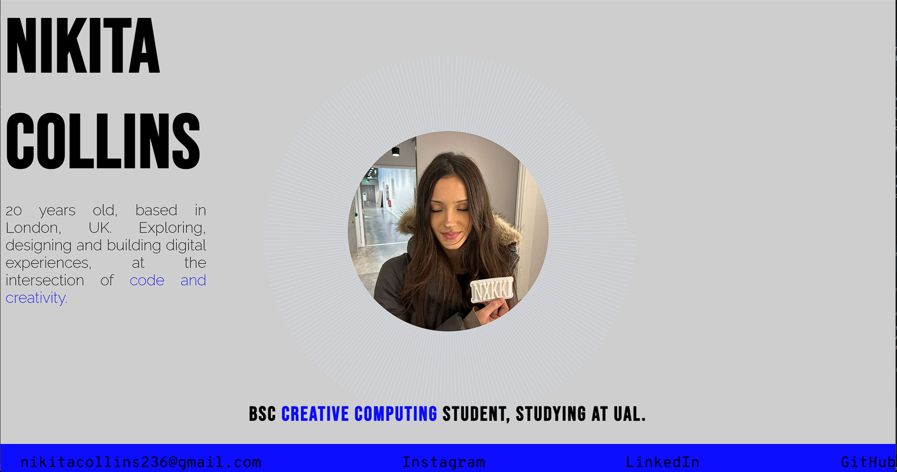

- background is too white so the lines aren't visible enough
- minRadius is too long, lines overlap with text on the botttom 
- also doesn't actually play, need to create buttons to play
    - want to use custom pngs

27/01/26
- started up index.html and sketch + music started working!?!?
- still having problem where only portion of the lines in the sketch react to the movement
- currently using ```let overallMovement = level * 150;```, global amplitude scaling 
- might work better if i redistribute spectrum values to ensure all lines move
- changed amplitude scaling to:
```let bass = fft.getEnergy("bass");
    let mid = fft.getEnergy("mid");
    let treble = fft.getEnergy("treble");
    let overallEnergy = (bass + mid + treble) / 3;
```
to get all frequency ban energies but still doesn't work
- think i might have to settle with this look, suspecting its the ambient audio file itself that doesn't have many frequencies to begin with
- went back to code I j had before recent change, like the movement here more
- final tweaks before moving on: editing bg colour and also h1 title for colour pallette 

going to try add a mute button for accessibility purposes - may be distracting or for deaf visitors

- got mute png from: https://pixabay.com/vectors/speaker-plain-sound-message-loud-305553/ 
- added button png into button div class, easier to edit positioning
- got mute function working:
- edited html to display mute button png at top center
- added toggleMute() function in sketch.js:
```const muteButton = document.getElementById('muteButton');
  muteButton.addEventListener('click', toggleMute);
```
```function toggleMute() {
  if (!song) return;

  isMuted = !isMuted;
  song.setVolume(isMuted ? 0 : 1);
}
```
- also added some styling:
- button 'hover' class: enlarges and glows when mouse hovers over - indicates interaction
- nice transmission from muted to play, lines retract quickly inwards
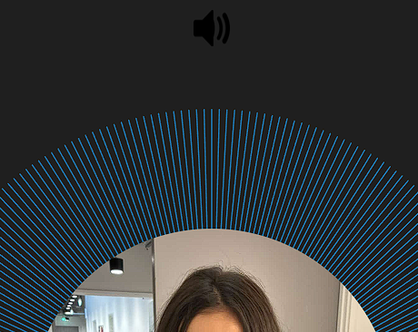 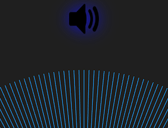


- due to time constraints, i will leave most of the styling here.
- however, might change h3 colours, feel like its fading into the background 
- changed text colours to white, think this compliments grey background better and also ensures readability
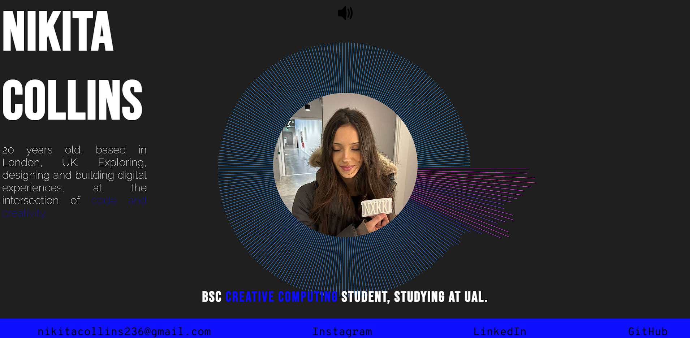

- need to move onto adding weekly tasks and ensuring they are accessible
- closed the tab, reopenined it and now the sketch isnt playing again... thinking this is browser audioplay issues
- might troubleshoot by adding in a click to start function on the music/sketch

- got this to work: sketch only runs after user cicks once anywhere 
- changed startAudio() function: 
```function startAudio() {
  if (!audioStarted && song.isLoaded()) {
      userStartAudio();
      song.loop();
      song.setVolume(1);
      audioStarted = true;
    }
  }
```
(used to be a loaded() function where the song just automatically starts looping once loaded)
- but I want the sketch to already be there, just the music and the reactions start after the click
- need to gate the audio logic - draw() should run immediately, FFT + amplitude after audio starts

- ```let audioStarted = false``` &  ```let isMuted = false```
- made sure song is preloaded, logging in console when done

Took a break from coding this, but the music now starts upon first click
- took lots of time out to complete weekly tasks so they are ready to put into the website

# CODING 3 WORK LINK #
thinking something like:
  - button that says 'Coding 3 Work'
  - opens a modal popup with every week listed
  - each week has a small preview of the code + focus of weekly work
  - outcome screenshot preview?
  - link to full work on github

- added Coding 3 button:
```<button id = "openWorkBtn" class = "coding3-btn">Coding 3 Work</button>``` 

- using div class to create window popup 
- framework for each week:
```<details>
                    <summary>Week 1</summary>
                    <div class = "week-body">
                        <p>Anatomy of a Web Page 1</p>
                        <div class = "week-actions">
                        <a class = "week-btn-link" target = "_blank"
                            href = "https://github.com/krispy2306/coding-3_web-design/tree/main/week%2001">
                            View on GitHub
                            </a>
                        </div>
                    </div>
                </details>
```
- the same, repeat for every week, changing <p> tag and link

- adding button into css
- did lots and lots of styling for the whole popup window

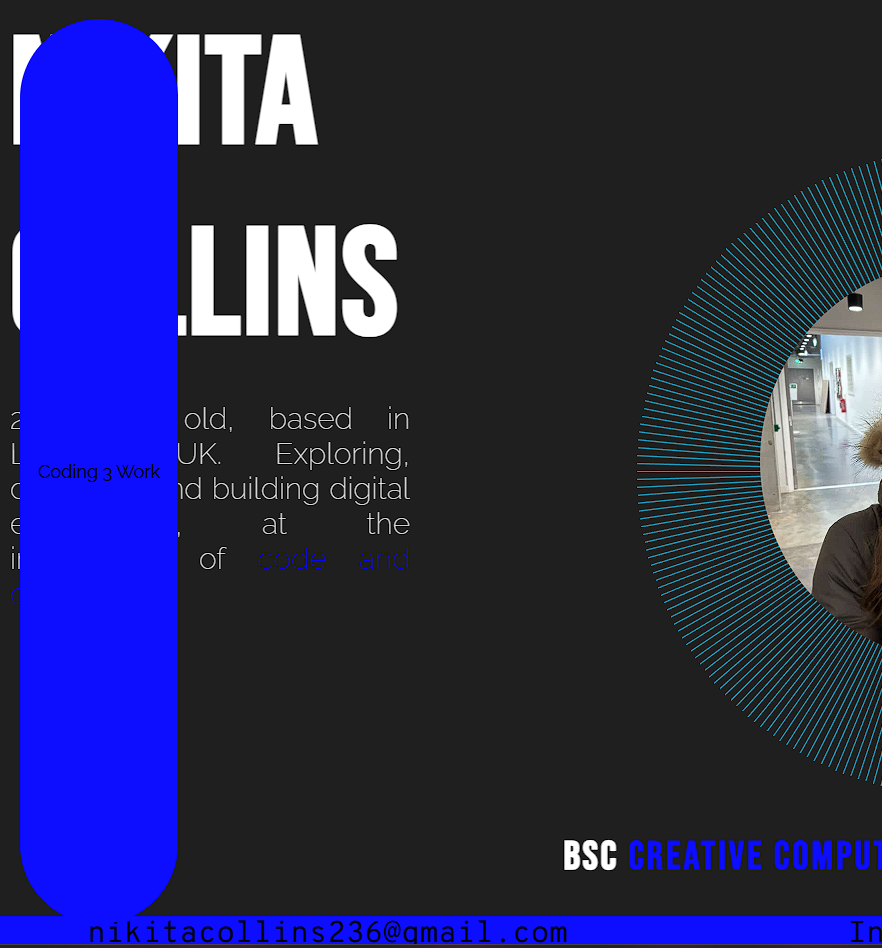
woops - need to fix button
- need it on right-hand side and way smaller

- needed to change previous mute button class to specify for mute button - was applying to all buttons

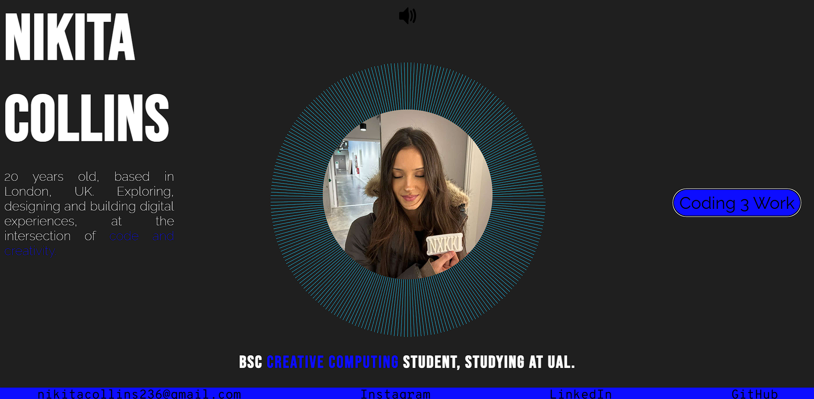
- fixed position + sizing
- also added same hover animation to button:
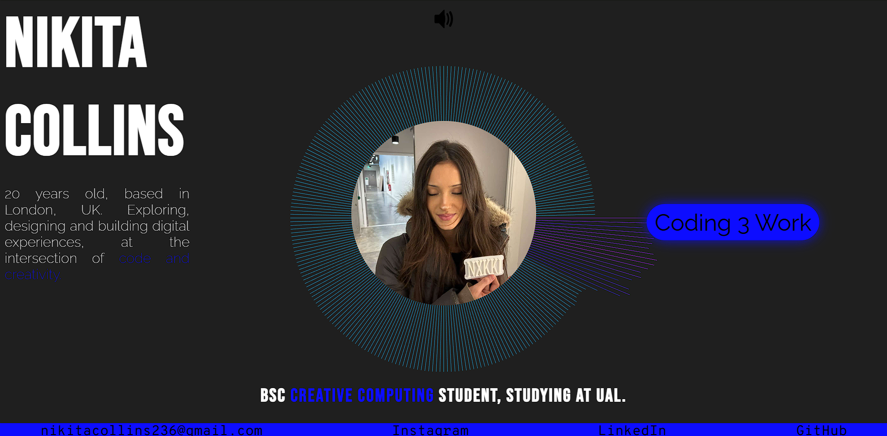
- might add slightly more padding

- button not actually working yet: fix
- added overlay for when window is open
- issues with HTML structure + typos - fixed


it works!!!
- need to change transparency
- done

- links also work great
- altered letter-spacing for 'Bebas Neue' font as letters are quite cramped - increased readability
- almost there.. need to add in preview pic of work + small description

- went back and took screenshots of every single weekly task outcome
- added into assets

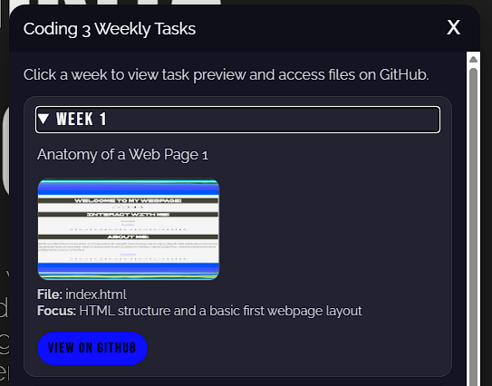
- final preview of week task!
- final html structure:
```<details>
                    <summary>Week 1</summary>
                    <div class = "week-body">
                        <p>Anatomy of a Web Page 1</p>

                        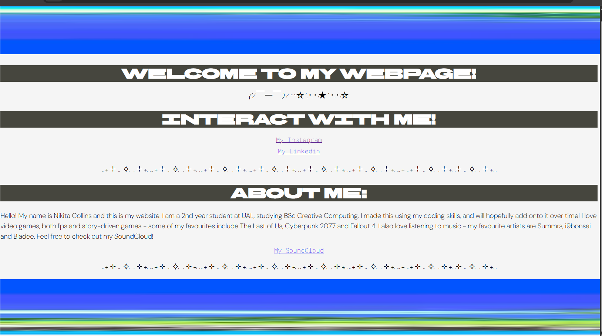

                        <p class = "week-desc">
                            <strong>File:</strong> index.html <br>
                            <strong>Focus:</strong> HTML structure and a basic first webpage layout
                        </p>

                        <div class = "week-actions">
                        <a class = "week-btn-link" target = "_blank"
                            href = "https://github.com/krispy2306/coding-3_web-design/tree/main/week%2001">
                            View on GitHub
                            </a>
                        </div>
                    </div>
                </details>
```
- basically the same for every other week - adding now
- added - previews all working now!!

- want to add in a contrast toggle button for accessibility
- in top right corner

- light mode icon: https://pngtree.com/freepng/sun-line-black-icon_4750183.html 
- dark mode icon: https://pngtree.com/freepng/vector-new-moon-icon_4049286.html 

- added in button with icon:
```<button id = 'contrastToggle' class = 'contrast-btn'>
                
            </button>
```

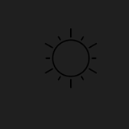 
- toggle on screen
- switches to moon icon upon click


- logic doesn't work too good right now, no actual background colour change

- lots of css changes
- great colour changes working but text isnt changing
- adding into css text changes
- black text in light mode, but keep blue highlight

- also keep top-bar blue, but maybe change the shade
- ended up keeping same blue, just changing text to white

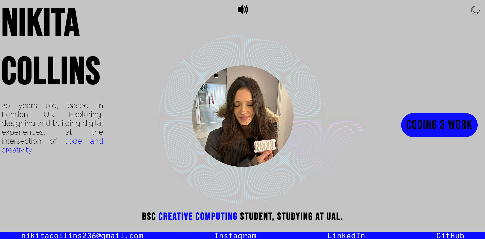
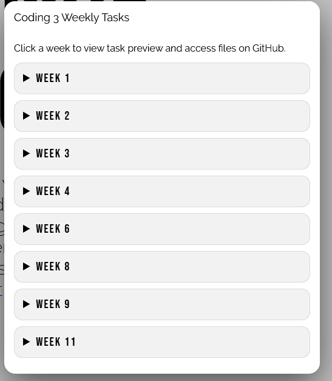
final colour contrast mode!

- actually, making icon a bit bigger
- changed to 60p x 60px

# FINAL WRITEUP #

FINAL DESIGN FEATURES:
- personal portfolio website
- contains p5.js music visualiser sketch updated from last year in center: adds a personal feel, more interesting page elements and interaction (mute/unmute)
- sketch plays upon first click 
- large h1 header of my name: communicates clearly
- small intro about myself
- contains links at the bottom to my other socials: easy contactability
- contains popup window of weekly class tasks 

FINAL ACCESSABILITY FEATURES:
- consistent colour theme: not confusing, doesn't distract from text
- large text size: good readability
- not too much busy text: clear layout, not too chaotic, readability still clear
- added alt texts 
- added a colour contrast mode: light and dark mode toggled in corner, could help those with visual impairements, ease on eyes
- clear interactivity: animations upon hover on interactable elements, guides user while still being intuitive
- added mute option for music visualiser sketch: may be distracting to some
- navigation is simple: main home screen + small window popup (homescreen still visible) - minimal elements

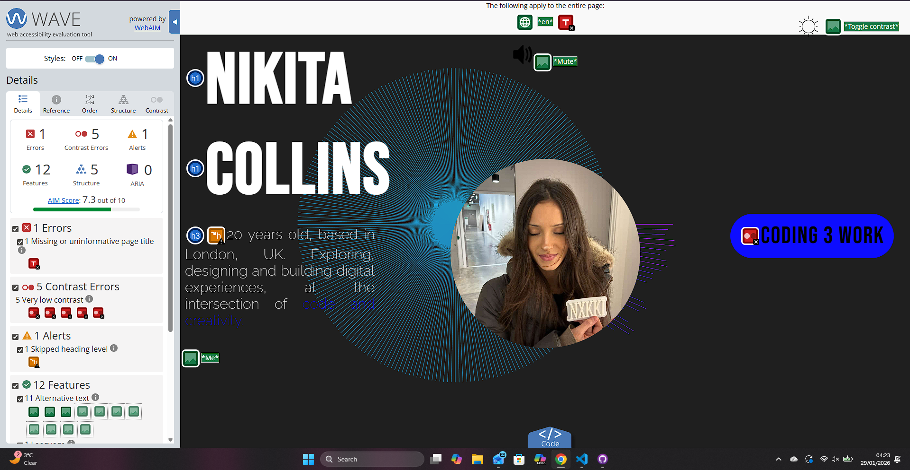
accessibility evaluation from WAVE Evaluation Tool browser extension (downloaded from chrome web store: https://chromewebstore.google.com/detail/wave-evaluation-tool/jbbplnpkjmmeebjpijfedlgcdilocofh) 
- final AIM Score: 7.3/10!!! not bad!

- WAVE evaluation tells me a few things:

ACCESSIBILITY FEATURES POTENTIAL:
Still have lots of potential for improving accessibility
  - needs more high contrast colour (5 contrast errors)
  - need page title 
  - need to add in heading level 

- also hope to add in the future: link my soundcloud to loop songs im personally listening to (embed code feature from sharing on soudcloud)


